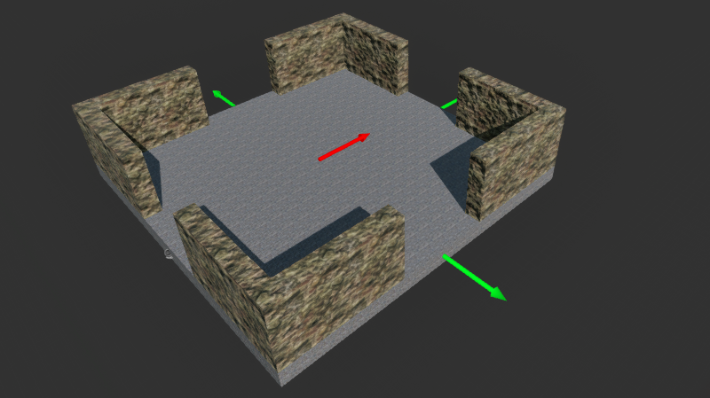

# Level-Generating-AI

  

## A Runtime Procedural AI System

Welcome to the repository for the **Dungeon Level Generator**, a standalone runtime AI system developed in **Unreal Engine 5**. Unlike a standard editor tool, this project functions as an intelligent AI Agent that constructs coherent, playable dungeon layouts dynamically during gameplay.

The system utilizes a collection of pre-built architectural modules (rooms, hallways, corners) and intelligently connects them by adhering to strict spatial rules and connection logic. This allows for infinite variations of level layouts without requiring manual placement by a designer.

This project demonstrates advanced proficiency in **vector mathematics**, **transform logic**, and **recursive algorithm design** within the Unreal Engine ecosystem.

---

### Project Showcase

| Modular Assets & Sockets | Generation Logic | Final Layout |
| :---: | :---: | :---: |
|  |  |  |

---

### Core Features

* **Runtime AI Generation:** The level is constructed in real-time by an AI agent, allowing for infinite replayability and dynamic environment creation.
* **Smart Socket System:** Utilizes a custom socket-matching system where modules "snap" together based on vector alignment, ensuring seamless geometry without gaps.
* **Quota-Based Expansion:** The system accepts target parameters (e.g., "Generate 20 Rooms"), and the AI manages the expansion loop to meet this exact criteria.
* **Collision & Path Validation:** Before placing a module, the algorithm performs bounding-box checks to ensure the new room does not intersect with existing geometry, guaranteeing a valid playable path.

---

### My Role: AI & Systems Programmer

This was a solo project where I engineered the complete generation pipeline. My primary contributions included:

* **Algorithmic Placement Logic:** I designed the core recursive function that selects a random module, identifies open attachment points (sockets), and attempts to spawn a compatible room.
* **Vector Math & Alignment:** I implemented the transform logic that calculates the precise position and rotation needed to align "Socket A" of a new room with "Socket B" of an existing hallway.
* **Constraint Satisfaction:** I programmed the fallback logic where, if a room cannot fit due to collision, the AI discards it and attempts a different module or terminates that branch to prevent "dead ends."
* **Modular Asset Setup:** I modeled and prepared the 3D assets, setting up the "Snap Points" and data tags that the AI reads to understand which modules can connect to each other.

---

### Tech Stack

* **Engine:** Unreal Engine 5
* **Logic:** Blueprints & C++
* **Technique:** Procedural Content Generation (PCG)
* **Math:** Vector Algebra & Transform Matrices
